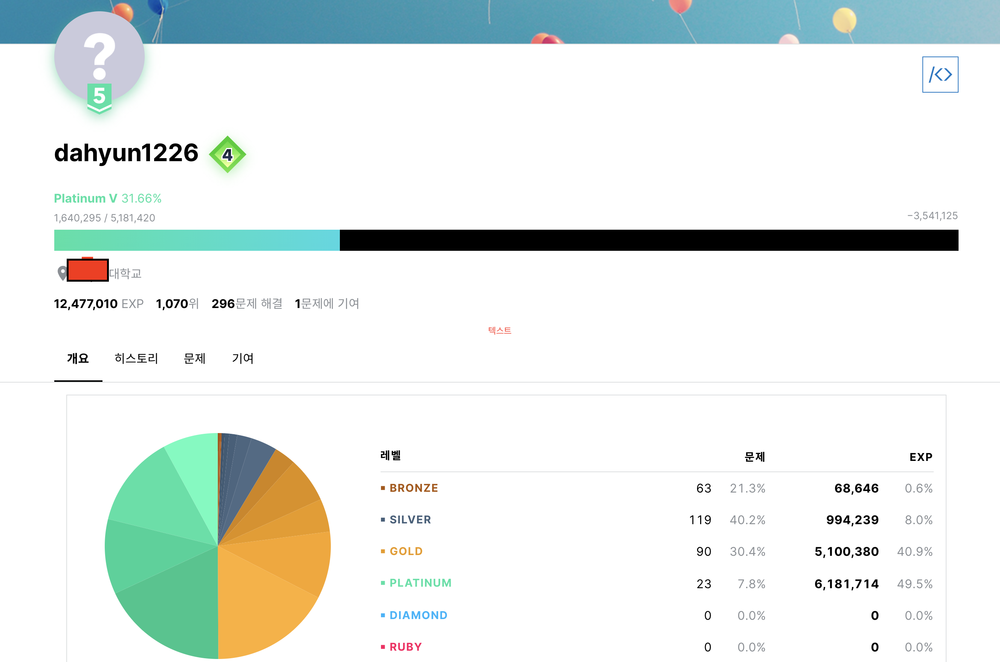
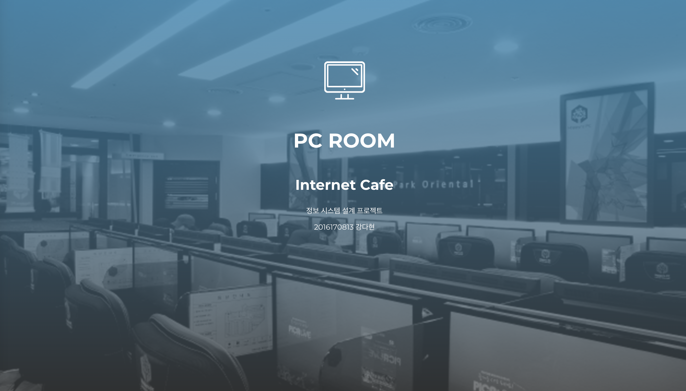
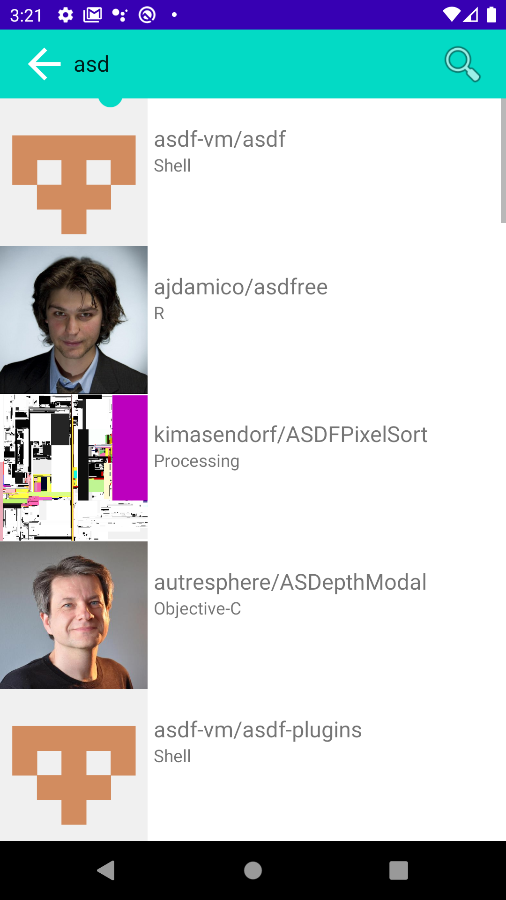
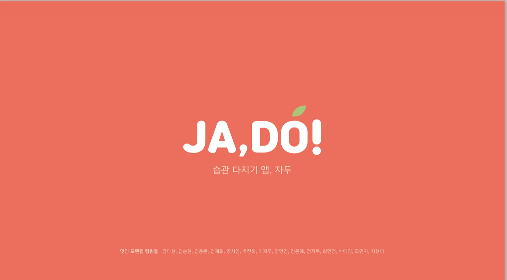
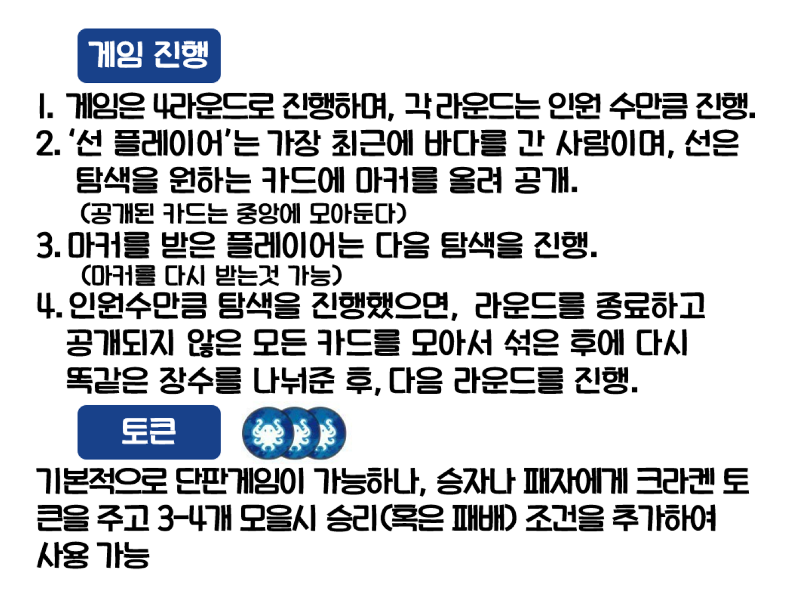

# Kang Dahyun Resume

\*\*대학교 산업경영공학부 전공

2016.03 ~ 진행중

대한민국 공군 만기 전역

2018.01 ~ 2019.12

IT 커뮤니티 MASH - UP

2020.03 ~ 진행중

백준 온라인 저지 

---
# 프로젝트

## PC방 관리 웹 프로젝트

#### 사용 스택 : MYSQL, NodeJS (Koa-Server), React

학교에서 진행한 프로젝트로, 데이터를 관리하는 웹 사이트를 만드는 것이 목표였습니다. 저는 PC방 관리 웹을 만들었고, 회원 가입, 음식 주문, 사용시간 충전, 자리에 앉기 / 나가기 / 시간 연장하기, 게임 로그인 / 로그오프, 어드민 통계 및 회원 정보 확인 기능들을 구현했습니다. 세부적으로는 음식 요일별 할인, 이용시간 초과시 자동 자리 나가기 기능, 자동 게임 로그오프 기능을 구현했고, 어드민 통계로는 게임별 점유율과 음식 매출액 등을 원하는 기간별로 구할 수 있게 만들었습니다.

React로 프론트엔드를, MYSQL과 NodeJS (Koa-Server)로 백엔드를 구현했고, 각 언어의 특성을 알고 능숙하게 사용하기보다는, 기능만 잘 수행하게 만든 프로젝트였습니다. 하지만 데이터 스키마를 작성하고, 그 스키마를 데이터베이스에서 직접 구현해봄과 동시에 실제로 서버와 연결된 웹을 구현해봄으로써 전반적인 프로세스를 알게 된 좋은 기회가 되었다고 생각합니다.

프로젝트 사진

#### 프론트엔드 React

___

#### 백엔드 (MYSQL, NodeJS (Koa-Server))

---

## HellchangCounter 앱 프로젝트

#### 사용 스택 : React-Native (expo)

'헬창카운터'는 간단하게 원하는 운동 횟수를 카운팅을 해주는 앱입니다. 운동을 하며 이러한 앱이 있으면 좋겠다고 생각한 찰나, 이런 기능을 가진 비슷한 앱이 시장에 마땅찮은 게 없는 것 같아 직접 만들어보자라고 생각했고, 아는 지인분이 이런 앱의 디자인을 해보고 싶다는 분이 계셔서 함께 진행했었습니다. 저는 디자인을 뺀 전반적인 개발을 맡았고, 디자인 툴은 Figma를 사용했습니다.
새롭게 크로스 플랫폼 프레임워크를 써서 진행해보면 괜찮겠다 싶어서 React-Native를 선택했고, React-Native에 더 익숙해지기 위해 이 앱을 만들기에 앞서 선행으로 '노마드 코더'라는 강의 사이트에서 클론 코딩으로 간단한 TODO 앱과 날씨 앱을 만들어보기도 했습니다.

디자인 툴을 보고, 상대 좌표와 절대 좌표를 고려하지 않고 개발 하였다가 약간의 낭패를 본 이후, 디자인을 맹목적으로 따라가기보다는 생각을 하면서 진행하는 플랫폼에 맞게 개발해야 한다는 것을 깨달았습니다.
'헬창카운터'의 내용은 단순히 카운팅 횟수를 설정 가능한 앱이었지만, 개발 도중 실제로 사용해보고 추가적으로 필요하다고 생각해서 템포 설정이 가능하게 만들었습니다. 앱의 내용이 간단하기에 처음엔 Expo로 진행하여 배포하려 했지만, Expo로 단순히 빌드 하면 필요 없는 권한까지 요구한다는 것을 깨닫고, 필요한 권한만을 요구하면서 배포를 하기 위해 AndroidManifest 파일을 바꿔야 했습니다. 그래서 Expo를 eject를 할 수밖에 없었고 이는 쉽게 시작하는 것이 - 비단 expo뿐만 아니라도 - 꼭 좋은 것만은 아니라고 생각하게 되었습니다. 이 과정에서 배포 버전의 검증을 위해 안드로이드의 릴리스 모드가 따로 있다는 것을 알게 되기도 했습니다. 또한, expo는 확실히 편하지만 상대적으로 사용자가 적어 스택오버플로우 등지에 질문이 별로 없고, 있어도 신뢰도가 다소 떨어지는 답변들이 많다는 것을 알게 되었습니다. 즉, 확실히 사용자가 적은 플랫폼/언어는 트러블 슈팅이 상대적으로 힘들다는 사실을 깨닫게 되었습니다.

그리고 이건 약간 논외지만 스스로가 아직 신생 개발자이기에 기본적인 해결이 가능한 문제가 많아 구글에 바로 질문하는 의존도가 높은 건 어쩔 수 없다고 생각했습니다. 그러나 실력과 연차가 쌓이면서 더 어려운 문제를 맞닥뜨릴 것이고, 언제까지나 구글에 바로 질문하는 것만으로는 모든 문제가 해결이 불가능할 것입니다. 따라서 어느 정도는 주체적으로 - 질문에 스스로 해결책을 만들어 답할 수 있는 - 문제를 해결할 수 있는 능력을 미리미리 잘 길러야 한다고 생각하기도 했습니다.

이 앱은 플레이스토어에 처음으로 배포를 해본 앱이기도 합니다. 실수로 플레이스토어의 업로드 키를 분실하는 이슈가 생겨, 그로 인해 구글에 업로드 키를 다시 설정해달라는 요청 메시지를 보내고 재배포하는 상황을 겪기도 했습니다. IOS는 추후 다른 앱도 배포할 계획일 때 개발자 계정을 활성화시켜 같이 배포를 해볼 생각입니다.

프로젝트 사진

### 날씨 불러오는 앱

### TODO 앱

### Hellchang Counter 헬창카운터

___

## 안드로이드 토이 프로젝트

#### 사용 스택 : 안드로이드 (코틀린)

#### 주요 기술 : Repository 패턴, RX, MVVM, DI

학습을 위한 토이 프로젝트였으나, 프로젝트라기보다는 스터디라고 해도 될 것 같습니다. Github에서 제공하는 API를 통해 다른 사람의 Repository를 검색해볼 수 있는 간단한 서비스를 구현하는 프로젝트로, 주요 기술들 - Repository 패턴, RX, MVVM, DI, LiveData 등을 순차적으로 적용해 보고, 기술 적용 전과 후를 비교하며 어떤 점이 달라졌고 왜 사용하는지에 중점을 두어 학습하는 방식이었습니다. 최종적으로 MVVM으로 작업했을 때, 이전과 무엇이 달라졌고 무엇이 좋아졌는지 알게 되었습니다. 깃에서 Pull Request 한 코드가 다른 개발자분들의 코드 리뷰를 받으며 발전해 나가는 양상이 너무 즐거웠고, 꼭! 반드시! 코드 리뷰 문화가 잘 정착된 회사에 가고 싶다고 생각이 들었습니다. 비록 완벽하진 않지만 여러 새로운 패러다임과 기술을 알게 된 경험이었습니다. 동시에 공부할 것이 차고 넘친다는 생각에 두근거리기도 했습니다.

프로젝트 사진

___

## JA, DO!

#### 사용 언어 : 안드로이드 (코틀린)

#### 주요 기술 : Repository 패턴, RX, MVVM, DI

아래의 토이 프로젝트에서 배웠던 기술을 써먹을 수 있었던 프로젝트였습니다. JA, DO!는 과일 캐릭터가 들어간 습관 동기부여 앱입니다. 습관을 수행하지 않으면 과일이 점점 죽어가고, 수행했을 때 다시 HP가 차오르는 콘셉트로, 디자인, 백엔드 각 3명, IOS, Android 각 4명의 총 14명 대규모 인원이 참가한 프로젝트였습니다. 전반적인 기획은 모두 다 같이 했는데, 오히려 14명이라는 인원이 아이디어 기획 회의에서는 사람 수가 많은 게 사공이 많으면 배가 산으로 가듯, 체계적이지 않으면 약간은 단점이 될 수도 있다고 생각했습니다. 개발 쪽에서는 안드로이드 앱의 스플래시와 구글 로그인, 완성된 과일 바구니 화면 (습관을 오랫동안 지속시켜 성공시키면 과일 바구니로 들어가는 설정이었습니다.)의 카드 뷰를 맡았습니다. 이전에 연습으로 카카오 로그인을 react-native에서 연습한 적이 있었지만, 다른 로그인은 처음 경험해 보았습니다. 함부로 토큰을 Preference등에 저장하면 안 된다는 것을 배우기도 했습니다.

기획 이후에 해커톤을 통해 몰아쳐서 진행했던 프로젝트였고, 다른 개발자분들, 디자이너분들과의 협업을 제대로 해본 첫 번째 경험이었습니다. 이때 특히나 다른 분들이 코드를 짜는 것을 직접 옆에서 보고 많이 배울 수 있었던 시간이었습니다. 해커톤 이후에도 코드리뷰를 받으며 개발하여 목표 했었던 기능은 완성시켰습니다. 코로나 사태로 인해 당초 프로젝트 일정이 많이 늦춰졌고, 오프라인 모임이 진행되기 어려워서 자꾸 지체되어 아쉬웠던 프로젝트입니다. 하지만 꼭 배포 성공으로 마무리 지을 계획입니다.

프로젝트 사진

___

## Dlinkers

#### 사용 스택 : NestJS, MariaDB (AWS RDS), AWS EC2

Dlinkers는 맥주 추천 스타트업 프로젝트로, 평소 알고 지내던 개발자 형님께서 처음 접하는 기술들을 한 번 경험해보라는 의미에서 외주 인턴 느낌으로 2달 정도 참여를 권유하여 하게 된 프로젝트입니다. AWS의 RDS를 통한 MariaDB와 NestJS에 연결해서 백엔드 스택을 구성해보았습니다. 이때, NestJS를 서버의 스택으로 사용한 이유는 상대적으로 다른 서버 (스프링이라든지)에 비해 가벼웠기 때문입니다. EC2에 만든 서버를 배포하는 것까지 진행했었는데, 리눅스를 제대로 처음 접해본 기회라 해도 과언이 아니었기에 쉬운 과정은 아니었지만, 서버를 다루는 경험은 정말 새롭고 재미있었습니다. 이 부분에서는 생활코딩의 리눅스 강의가 도움이 되었던 것 같습니다.

이외에도 서비스 기획에 참가하여 어떻게 더 좋은 서비스를 제공할지 매주 토론했었습니다. (스타트업 내 대외비라 이 부분은 자세히 설명할 수는 없을 것 같습니다.)

___

## BOARD GAME WORLD

#### 사용 스택 : 안드로이드(코틀린), NestJS, MariaDB (AWS RDS), AWS EC2

#### 주요 기술 : Repository 패턴, RX, MVVM, DI

'보드게임 월드'는 보드게임을 소개해 주는 앱 프로젝트입니다. 평소 보드게임을 좋아하는 저에게는 도감 같은 형식의 앱이 없다고 생각하여 이러한 앱에 대한 니즈가 있지 않을까 생각했습니다. 보드게임 카페에 가면 보드게임이 책자로 소개되거나 '레드 버튼' 같은 회사에서의 자체 플랫폼의 앱으로만 소개된다는 것을 알고 누구나 보드게임 카페에 갔을 때 범용적으로 쓸 수 있는 앱을 고안했습니다. 그러기 위해서는 보드게임의 룰이 잘 소개되어야 한다고 생각하여 룰 이미지를 자체 제작하고 있습니다. 이렇게 자체 제작한 이미지가 웹툰의 방식처럼 이미지가 탈취되지 않았으면 좋겠다고 생각하여 처음엔 리소스를 암호화하는 방식을 생각했지만, 본질적으로 힘들다는 것을 깨닫고 서버에서 받아오는 형식을 생각했습니다. 물론 서버에서 받아오는 이미지에 대해서도 앱 내의 캡처를 방지하는 것을 기본으로, 제대로 보안에 대해 생각해야 할 것입니다. 개인적으로는 상업성이 있을 것이라 생각하는 첫 번째 프로젝트라고 생각합니다.

이러한 앱을 지금까지 배운 것들을 통합해서 개발해보고 있는 중입니다. 안드로이드 개발이 성공적으로 끝나면 IOS로도 개발해보면 재밌을 것 같다고 생각하고 있습니다. 또한, 추가적인 기능으로 보드게임 카페들에 대한 리뷰 기능도 넣으면 좋을 것 같다고 생각하고 있습니다.

프로젝트 사진

### 보드게임 설명 자체 제작 사진 - 달무티

### 보드게임 설명 자체 제작 사진 - 돈 터치 크라켄

### 보드게임 설명 자체 제작 사진 - 스플렌더

___
